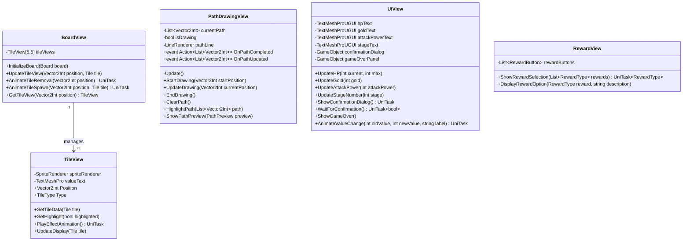

# クラス図：一筆書きローグライクゲーム

## 全体構造図

## レイヤー別詳細図

### Model層の詳細

### Tile階層の詳細

### Presenter層の詳細

### View層の詳細

### 設定とデータ構造

## シーケンス図：ターン実行フロー

## 主要な設計パターン

### 1. Model-View-Presenter (MVP)
- **Model**: ゲームロジックとデータ（GameState, Player, Board, Tile等）
- **View**: UI表示と入力検出（BoardView, UIView, PathDrawingView等）
- **Presenter**: ロジック制御と状態遷移（GamePresenter, CombatPresenter等）

### 2. Strategy Pattern
- Tileクラス階層で各タイプの効果を実装
- ApplyEffect()メソッドで異なる動作を実現

### 3. Observer Pattern
- PathDrawingViewのイベント（OnPathCompleted, OnPathUpdated）
- PresenterがViewのイベントを購読

### 4. State Pattern
- GamePhase列挙型でゲーム状態を管理
- GamePresenterが各フェーズのハンドラを実装

### 5. Factory Pattern
- タイル生成でTileSpawnConfigを使用
- 確率に基づいて適切なTileサブクラスを生成
